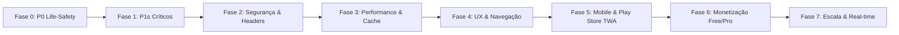

# KITE NINJA — ROADMAP ESTRATÉGICO DE EVOLUÇÃO (2026)
## AGENTE: ANTIGRAVITY · MODO AUDITORIA & PLANEJAMENTO
## BASEADO NOS ACHADOS DE `docs/ANTIGRAVITY-FINDINGS.md`

---

## 1. TOP 10 PROBLEMAS CRÍTICOS

Ordenados por **Risco + Impacto + Probabilidade de Ocorrência**:

| # | ID | Título | Categoria | Risco | Impacto |
|---|---|---|---|---|---|
| **1** | **ANT-001** | SOS sem GPS disparado fora de downwind ativo falha em notificar qualquer socorrista | SOS / Life-Safety | Crítico | Alto |
| **2** | **ANT-002** | Rate limit de SOS é cobrado antes de deduplicar e bloqueia atualização de coordenadas à deriva | SOS / Rate Limit | Alto | Alto |
| **3** | **ANT-005** | Injeção DOM XSS em marcadores Leaflet DivIcon de SOS e Socorristas | Security / XSS | Alto | Alto |
| **4** | **ANT-003** | Rastreamento GPS de Downwind e Presença para 100% ao bloquear a tela (`document.hidden`) | GPS / Mobile | Alto | Alto |
| **5** | **ANT-004** | Ausência de cache/offline no Service Worker (`sw.js`) gera crash de conexão na Play Store | PWA / Mobile | Alto | Alto |
| **6** | **ANT-006** | Login permite autenticação de contas suspensas (`is_active = FALSE`) | Auth / Security | Médio | Médio |
| **7** | **ANT-007** | Cron de escalada SOS na Vercel roda apenas 1x/dia no plano Hobby | SOS / Infra | Alto | Médio |
| **8** | **ANT-008** | Ausência total de Security Headers HTTP (HSTS, CSP, X-Frame-Options) | Security | Médio | Médio |
| **9** | **ANT-011** | Ausência de `assetlinks.json` para Android TWA (exibe barra do navegador no app) | Mobile / UX | Médio | Médio |
| **10** | **ANT-010** | `GET /api/spots` sem cache distribuído compartilhado (risco de quota Open-Meteo) | Weather / Scale | Médio | Alto |

---

## 2. TOP 10 MELHORIAS DE MAIOR IMPACTO

Ordenadas por **Impacto no Produto / Relação de Esforço**:

| # | Melhoria | Subsistema | Impacto | Esforço |
|---|---|---|---|---|
| **1** | **Sincronização Offline de Trilha (Outbox IndexedDB)** | GPS / Downwind | Alto | Médio |
| **2** | **Foreground Service Nativo para Tracking em Background** | Android / Mobile | Alto | Alto |
| **3** | **Upload de Fotos para Vercel Blob (Fim do Base64 no Postgres)** | Storage / DB | Alto | Baixo |
| **4** | **Arquitetura de Entitlements Free (2 spots) vs Pro (Ilimitado)** | Monetização | Alto | Médio |
| **5** | **Cache Distribuído de Clima e Marés (Upstash Redis / Vercel KV)** | Performance / Weather | Alto | Baixo |
| **6** | **Headers de Segurança HTTP e Content Security Policy (CSP)** | Segurança | Alto | Baixo |
| **7** | **Substituição de Polling por SSE / WebSockets (SOS e Chat)** | Escalabilidade / Neon | Alto | Alto |
| **8** | **Paginação por Keyset no Logbook (`GET /api/sessions`)** | Performance / DB | Médio | Baixo |
| **9** | **Centralização de Rate Limiting com Janela Deslizante no Banco** | Segurança / Auth | Médio | Baixo |
| **10** | **Observabilidade, Alertas e Crash Reporting (Sentry / Axiom)** | DevOps / SRE | Alto | Baixo |

---

## 3. ROADMAP DE FASES

---

### FASE 0 · P0 Life-Safety (Emergência Imediata)
**Objetivo**: Garantir que nenhum pedido de socorro falhe em alcançar a comunidade, mesmo sob falha de GPS.

- [ ] **0.1** Implementar fallback de localização em `lib/sosCandidates.ts`:
  - Se `origin === null`, consultar `user_presence.pos_updated_at` recente ou `at_spot_id`.
  - Se não houver spot na presença, buscar `home_spot` em `users`.
  - Se nenhuma coordenada for encontrada, notificar administradores/moderadores e velejadores com presença online na região.
- [ ] **0.2** Isentar atualizações de coordenadas de SOS ativo do teto de rate limit em `app/api/sos/route.ts`.
- [ ] **0.3** Configurar acionador de cron externo (GitHub Actions / Cloudflare Worker) batendo em `/api/cron/sos-escalada` a cada 1 minuto com `Authorization: Bearer $CRON_SECRET`.
- [ ] **0.4** Testes adversariais de regressão em `scripts/verify-sos.ts`.

---

### FASE 1 · P1s Críticos de Segurança e Plataforma
**Objetivo**: Eliminar vulnerabilidades ativas de injeção, consistência de login e resiliência offline.

- [ ] **1.1** Aplicar `escaparHtml` em `components/LeafletMap.tsx` nas funções `createSosMarkerIcon` e `createResponderMarkerIcon` para mitigar DOM XSS.
- [ ] **1.2** Adicionar filtro `AND is_active = TRUE` em `app/api/auth/login/route.ts` com mensagem de erro clara para contas suspensas.
- [ ] **1.3** Adicionar manipulador básico de cache offline e fallback de rede em `public/sw.js`.
- [ ] **1.4** Validar formato UUID em `app/api/sos/[id]/route.ts`.

---

### FASE 2 · Blindagem de Segurança e Infraestrutura
**Objetivo**: Configurar headers HTTP estritos e controle centralizado contra ataques de força bruta.

- [ ] **2.1** Configurar `headers()` em `next.config.ts` com HSTS, CSP (permitindo Open-Meteo, Leaflet tiles, Vercel Blob), `X-Frame-Options: DENY` e `X-Content-Type-Options: nosniff`.
- [ ] **2.2** Migrar o rate limit de memória (`new Map()`) para tabela relacional no PostgreSQL com janela deslizante e limpeza periódica.
- [ ] **2.3** Adicionar índice composto `idx_chat_messages_user_created` em `chat_messages(user_id, created_at DESC)`.
- [ ] **2.4** Instalar e configurar observabilidade com Sentry para rastreamento em tempo real de erros de API e exceções de SOS.

---

### FASE 3 · Otimização de Performance e Armazenamento
**Objetivo**: Reduzir consumo de banco Neon e tempo de resposta das APIs.

- [ ] **3.1** Migrar upload de avatares e fotos de anúncios do Base64 em `TEXT` para `@vercel/blob`.
- [ ] **3.2** Implementar camada de cache distribuído para previsões meteorológicas da Open-Meteo via Upstash Redis / Vercel KV.
- [ ] **3.3** Implementar paginação keyset por cursor em `GET /api/sessions` para o histórico de navegações.
- [ ] **3.4** Criar índices ausentes em chaves estrangeiras (`sessions_log.spot_id`, `notifications.actor_id`).

---

### FASE 4 · Refinamento de UX e Usabilidade de Praia
**Objetivo**: Corrigir fricções visuais, ordenações e comportamento de geolocalização.

- [ ] **4.1** Corrigir reata automática do watcher de GPS em `views/MapView.tsx` após retorno de visibilidade (`visibilitychange`).
- [ ] **4.2** Migrar coluna `events.event_date` para `event_timestamp TIMESTAMPTZ` para ordenação cronológica precisa.
- [ ] **4.3** Adicionar indicador visual no card de downwind quando pontos de GPS estiverem sendo retidos localmente por falta de sinal.

---

### FASE 5 · Experiência Mobile Play Store & App Nativo
**Objetivo**: Elevar a experiência do app instalado via Google Play Store (TWA) e preparar base Capacitor/iOS.

- [ ] **5.1** Criar e servir `public/.well-known/assetlinks.json` com o SHA-256 da assinatura da Play Store para remover a barra superior do navegador.
- [ ] **5.2** Desenvolver Outbox com IndexedDB para acumular pontos de GPS offline durante o downwind e sincronizar em lote ao recuperar conexão.
- [ ] **5.3** Avaliar arquitetura de transição para Capacitor com plugin nativo de Background Geolocation e Haptics.

---

### FASE 6 · Arquitetura e Lançamento de Monetização
**Objetivo**: Viabilizar modelo Freemium sustentável sem quebrar usuários existentes.

- [ ] **6.1** Criar migração SQL com tabela `user_subscriptions` e enum de planos (`free`, `pro`, `vip`).
- [ ] **6.2** Implementar verificação de limites em `app/api/favorites/route.ts` (máximo de 2 spots favoritos no plano Free).
- [ ] **6.3** Criar Paywall Modal no frontend destacando recursos Pro (spots ilimitados, radar de alta precisão, histórico completo).
- [ ] **6.4** Integrar Google Play Billing (Digital Goods API / Google Play Billing Library) e Stripe.

---

### FASE 7 · Escalabilidade e Arquitetura Real-Time
**Objetivo**: Suportar crescimento de 1.000 para 100.000 velejadores simultâneos.

- [ ] **7.1** Substituir polling HTTP de 4s do chat e 12s do SOS por Server-Sent Events (SSE) ou WebSockets gerenciados (Pusher / Ably / Supabase Realtime).
- [ ] **7.2** Implementar particionamento temporal na tabela `downwind_posicoes` (por mês ou por evento).
- [ ] **7.3** Configurar CDN edge caching para endpoints estáticos (`/api/spots` com `stale-while-revalidate`).
